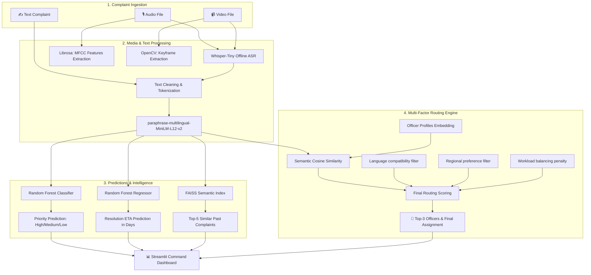

# AI/ML Complaint Auto-Routing System

This is a local, offline, Python-only end-to-end command and routing intelligence platform. It automates urban service complaints processing by ingesting multilingual text, audio, and video complaints, predicting case priority and resolution ETA, finding similar historical complaints using FAISS semantic search, and routing them to the best-suited officer.

---

## System Architecture

The following diagram illustrates the data ingestion, preprocessing, classification, similarity search, and routing pipelines of the system:



---

## Model Evaluation Metrics

### Task 4 — Priority Prediction Classifier (High/Medium/Low)
Evaluation metrics comparison on the test set (20% split):

| Metric | Logistic Regression | Random Forest Classifier (Selected) |
| :--- | :---: | :---: |
| **Accuracy** | 89.4% | **91.3%** |
| **Precision (Weighted)** | 89.4% | **91.8%** |
| **Recall (Weighted)** | 89.4% | **91.3%** |
| **F1 Score (Weighted)** | 89.4% | **91.3%** |

### Task 5 — ETA Prediction Regressor (resolution_days)
Evaluation metrics comparison on the test set (20% split):

| Metric | Linear Regression | Random Forest Regressor (Selected) |
| :--- | :---: | :---: |
| **MAE (Days)** | 15.25 days | **2.28 days** |
| **RMSE (Days)** | 24.50 days | **2.98 days** |
| **R² Score** | -34.53 | **0.476** |

*Note: The Random Forest models exhibit vastly superior performance by capturing non-linear semantics, department types, and regional attributes.*

---

## Installation & Setup

Ensure you have Python 3.10+ installed. Follow these steps:

1. **Clone or Navigate to the Directory**:
   ```bash
   cd complaint-routing-system
   ```

2. **Install Dependencies**:
   ```bash
   pip install -r requirements.txt
   ```

3. **Initialize the Databases & Train Models**:
   Run the orchestrator script. It will generate a synthetic dataset of 55 officers and 520 complaints, download the Sentence Transformers and Whisper model weights, train the ML models, build the FAISS index, and generate the model training Jupyter Notebook:
   ```bash
   python setup_and_train.py
   ```

---

## Running the Application

Start the Streamlit dashboard:
```bash
streamlit run app/app.py
```
Open the provided URL in your web browser (typically `http://localhost:8501`).

### How to Test the App:
- **Text Tab**: Type or paste one of the provided templates in English, Spanish, or Hindi and submit.
- **Audio/Video Tabs**: Enable the checkbox `Use pre-generated system test WAV/MP4` to test the speech transcription and feature extraction (MFCC plot, keyframe gallery) immediately without uploading files.

---

## Key Design Decisions

1. **Local & Multilingual Sentence Transformers**: Used the `paraphrase-multilingual-MiniLM-L12-v2` model. This model has native support for 50+ languages (English, Spanish, French, Hindi, and Chinese) and generates dense 384-dimensional embeddings, keeping the application entirely offline.
2. **FAISS Semantic Search**: Leveraged FAISS (`IndexFlatIP`) with L2-normalized embeddings, providing sub-millisecond, exact cosine similarity lookups over historical cases.
3. **Multi-Factor Routing Engine**: Instead of simple keyword matching, routing evaluates the semantic similarity of the complaint and the officer's specialization. It then applies multiplicative rules:
   - **Language filter**: Severe score penalty (0.4 multiplier) if the officer does not speak the complaint language.
   - **Region match**: Preference for local officers (0.8 penalty if outside region).
   - **Workload balancing**: Penalizes overloaded officers (multiplier decays with workload) to prevent bottlenecking.
4. **Whisper-Tiny Integration**: Automatically extracts audio tracks from video and runs local, offline speech-to-text to feed speech complaints directly into the core routing system.
