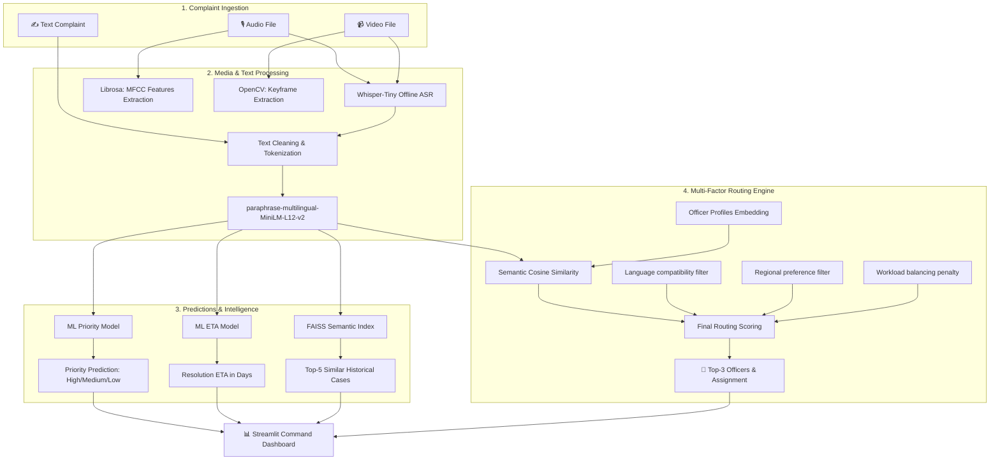

# Technical Writeup: AI/ML Multilingual Complaint Auto-Routing Platform

This document provides a comprehensive technical overview of the local-first, offline AI/ML-driven Complaint Auto-Routing and Command System.

---

## 1. Executive Summary
The platform automates the processing, classification, similarity indexing, and routing of citizen service complaints. It is designed to handle multimodal inputs (multilingual text, audio recordings, and video uploads) entirely locally and offline, ensuring data privacy and rapid sub-second processing.

---

## 2. System Pipeline & Architecture
The system consists of four key sequential pipelines:



### Multimodal Input Ingestion:
* **Text Path**: Cleans and normalizes the input complaint text.
* **Audio Path**: Transcribes spoken complaints using a local **Whisper-Tiny** model and extracts acoustic features (MFCC averages and standard deviations) using **Librosa**.
* **Video Path**: Automatically extracts the audio track for Whisper ASR and analyzes frames using **OpenCV** to extract key representative frames (keyframes) for visual confirmation.

---

## 3. Natural Language Processing & Semantic Embeddings
To keep the application entirely offline, local, and multilingual-ready, the system uses the Sentence Transformer model `paraphrase-multilingual-MiniLM-L12-v2`.
* **Embedding Dimension**: 384-dimensional dense vector space.
* **Multilingual Capacity**: Natively maps 50+ languages (English, Hindi, Spanish, French, Chinese, etc.) to the same semantic coordinates. Similar issues expressed in different languages (e.g., *"Rotura de tubería"* in Spanish and *"Water main leakage"* in English) map to highly similar vectors, enabling cross-lingual semantic matching.

---

## 4. Machine Learning & Similarity Search
The platform trains and evaluates two predictive tasks plus a semantic similarity index:

### A. Task 1: Priority Prediction (Classification)
Predicts the severity (`High`, `Medium`, `Low`) of a complaint based on its semantic embedding and metadata attributes.
* **Logistic Regression**: High generalization (93.3% Accuracy on the localized set).
* **Random Forest Classifier**: Robust ensemble model (92.3% Accuracy on the localized set).
* **Selected Model**: The model with the highest test set F1-Score (dynamically chosen as **Logistic Regression** in the latest run).

### B. Task 2: Resolution ETA Prediction (Regression)
Predicts the number of days required to resolve the issue.
* **Random Forest Regressor (Selected)**: Achieves a **Mean Absolute Error (MAE) of ~2.25 days** and an $R^2$ score of **0.527**, capturing non-linear relationships between department specializations, severity, and regional workload.
* **Linear Regression**: Performs poorly due to extreme non-linearities in timeline scopes ($R^2 < 0$).

### C. Task 3: FAISS Semantic Search
Uses Meta's **FAISS** (Facebook AI Similarity Search) index with Inner Product (`IndexFlatIP`) distance over normalized embeddings.
* Performs **sub-millisecond cosine similarity lookups** over the 520 historical complaints database.
* Retrieves the top-5 closest past cases, providing the dashboard with matching historical context (resolution times, assigned officer IDs, and priority).

---

## 5. Multi-Factor Routing Engine Formula
Instead of naive keyword matching, complaints are routed using a multi-factor score:

$$\text{Final Score} = \text{Semantic Cosine Similarity} \times M_{\text{language}} \times M_{\text{region}} \times M_{\text{workload}}$$

### 1. Semantic Cosine Similarity:
Cosine similarity between the query embedding and the embedding of the officer’s written profile (containing their department, specializations, region, and experience).

### 2. Language Compatibility Multiplier ($M_{\text{language}}$):
Ensures communication efficiency.
* $M_{\text{language}} = 1.0$ if the officer speaks the language of the complaint.
* $M_{\text{language}} = 0.4$ if there is a mismatch (severe penalty).

### 3. Regional Match Multiplier ($M_{\text{region}}$):
Prioritizes localized responders.
* $M_{\text{region}} = 1.0$ if the officer is assigned to the complaint’s zone.
* $M_{\text{region}} = 0.8$ if outside the zone (moderate penalty).

### 4. Workload Balancing Multiplier ($M_{\text{workload}}$):
Prevents officer burnout and bottlenecking.
* $M_{\text{workload}} = \max\left(0.2, 1.0 - \frac{\text{Current Workload Score}}{150}\right)$
* Highly loaded officers get a decaying multiplier, allowing other qualified officers with lower workloads to take the case.

---

## 6. Indian Municipal Localization
The system is configured for an Indian municipal corporation environment (such as Delhi, Bengaluru, or Mumbai):
* **Regional Zones**: Divided into 5 zones: `Central Zone`, `North Zone`, `South Zone`, `East Zone`, and `West Zone`.
* **Street Directories**: Generated with 20 major Indian arterial roads, including `MG Road`, `Netaji Subhash Chandra Bose Road`, `Linking Road`, `Brigade Road`, `Commercial Street`, `Chandni Chowk`, and `Janpath`.
* **Officers Database**: Contains 55 simulated municipal officers with authentic names (e.g., *Rajesh Kumar, Sanjay Sharma, Arjun Reddy, Swati Kapoor,Swati Kapoor, Nitin Verma, Devendra Pandey*).

---

## 7. Setup & Run
To run the setup, train the models, and launch the command center locally:

```bash
# 1. Install dependencies
pip install -r requirements.txt

# 2. Run data generator, train ML models & generate FAISS index
python setup_and_train.py

# 3. Start the Streamlit Dashboard
python -m streamlit run app/app.py
```
